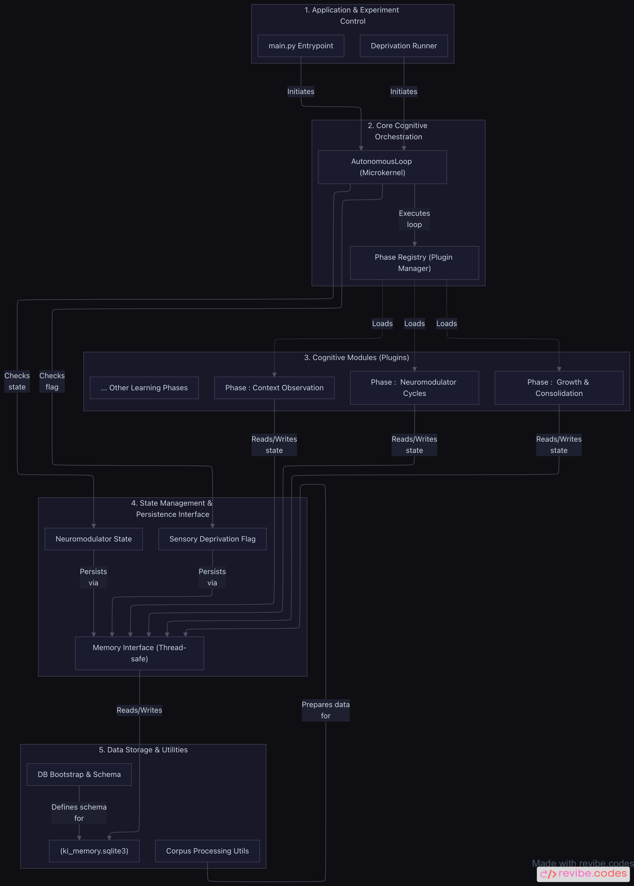

# BrainStem

Update 23.07.26

[](#current-development-and-testing-status)
[](#running-the-system)
[](#database-initialization)
[](#current-development-and-testing-status)


BrainStem is a biologically inspired, neuro-symbolic cognitive architecture for lifelong learning. It is designed to learn models of the structures and dynamics of language and text through context hypotheses, uncertainty, contradiction, revision, neuromodulation, replay, and consolidation rather than by merely storing isolated facts.

>One CPU Core /
>No GPU needed

> [!IMPORTANT]
> BrainStem is a research and calibration system, not a production-ready assistant. Permanent fact, relation, and question writes remain locked while the learning core and its candidate flow are being validated.

---

[](https://www.youtube.com/watch?v=4nN7zELSAMo)

YouTube - BrainStem Project AI conversation 22.07.26

---

## 📍 Navigation

* [Core Philosophy](#core-philosophy)
* [What is BrainStem really](#what-is-brainstem-really)
* [Architecture](#architecture)
* [Running the System](#running-the-system)
* [ZIM Import](#zim-import)
* [Development Notes](#development-notes)
    
---

[NotebookLM codebase exploration](https://notebooklm.google.com/notebook/22f86efd-8cd6-447b-a43f-65f252259ab4?utm_source=nlmm_share) 22.07.26

[Revibe codebase analysis](https://app.revibe.codes/shared/1WMamYip9Amived6mf-OF6OF0VNhcMWrekHg3c5bqkY)

---

## Current State

### Project-Structure

<a href="assets/Project-Structure.png" target="_blank">
  
</a>

### Current Validation Status

The current code and database state completed a new 1,344-cycle stability and drift validation. All requested cycles completed with correct V1/V2 accounting, unchanged protected tables, no checkpoint regressions, stable runtime hashes, successful periodic `quick_check` results, and a successful final `integrity_check`.

This validation establishes a runtime stability baseline for the exact tested state. It does not prove semantic learning effectiveness, independent real outcomes, future drift freedom, or Stage-B readiness.

#### Current Architecture

- Legacy Cleanup large slices A-C are complete; obsolete NLP, CorpusReader / Phase-3d, and historical Phase-4def-4p paths were removed.
- The canonical outer runtime owner remains Phase 7cort.
- The Modern Gap Candidate Bridge and Phase-5f Shadow Observation path remain checkpoint-based, bounded, `observed_only`, and non-productive.
- Candidate and Observation checkpoints reached the current population of 949,760 context hypotheses.
- Stable Observation Identity V2 separates stable identity, source version, projection version, and provenance.
- The Content-Stable Fingerprint classifier excludes timestamp-only changes from semantic content identity.
- The Modern Projection Contract is consolidated into a direct read-only evaluator. The former dynamic AST loader and first-write capture path were removed.
- Phase-6a Replay-Control Shadow Capture remains future-only, retry-safe, non-semantic, and disconnected from productive Candidate and Observation triggers.

### Corpus and Learning State

- 102,275 of 102,275 imported chunks were read.
- 949,760 context hypotheses exist.
- Replay, Phase 6b, consolidation, and the extended neuromodulator phases continue to run after corpus completion.
- Replay activity and control-state observation are proven, but replay-caused semantic learning and independent outcome-based effectiveness are not yet proven.

### Neuromodulator and Computational Kernel Status

All twelve neuromodulator systems are represented in code and live state: dopamine, serotonin, glutamate, GABA, noradrenaline, acetylcholine, endocannabinoids, histamine, orexin, BDNF, cortisol, and adenosine.

Pure no-SQL computational kernels are installed for the currently consolidated E/I, Phase-6b plasticity recommendation, endocannabinoid, and BDNF calculations. The old runtime path remains authoritative.

A 50-cycle future-only Shadow Dual-Run baseline completed successfully:

- 50 of 50 cycles completed
- six kernels reached in every cycle
- 300 Old/New comparisons
- 300 matches
- 0 mismatches
- 0 adapter blockers
- maximum absolute and relative delta: 0.0 for every exercised kernel
- `compute_2ag_release` was not naturally exercised

This is a strong multi-cycle parity baseline, but it does not authorize a runtime cutover or applied regulation.

### Current Safety Boundary

The following remain closed:

- productive `internal_learning_gaps` writes
- Attention writes
- productive Phase-5f, Phase-5g, and Phase-5i experiments
- Phase-5g outcomes
- `observation_ready`
- Facts, Relations, and Questions writes
- Fact promotion
- V2 reader switch, migration, or backfill
- kernel-based runtime cutover
- critic-gated applied regulation
- Cortisol Stage 2 application

SQLite remains the canonical relational source. A vector database may only be evaluated at the dedicated architecture checkpoint after stable identities, a concrete semantic retrieval use case, measurable requirements, and a read-only comparison against the SQLite baseline exist.

### Stage-B Status

Stage B is not ready. Current stability, identity, safety, All-12 state coverage, local E/I sensitivity, and six-kernel multi-cycle parity are established. Remaining evidence gaps include:

- independent, entity-bound, temporally valid real outcomes
- replay-linked semantic learning effects
- full end-to-end causal co-regulation of the twelve-modulator system
- critic-gated and reversible applied regulation
- Stage-B control enforcement for N=3 consolidation survival, warm-up damping, and an initial budget of one promotion per cycle

Facts promotion remains reserved for a separately validated later step.

### Next Major Step

Prepare a Pure-Kernel Wrapper Cutover Readiness and Rollback Preflight for the six multi-cycle parity-proven kernels. The preflight must preserve wrapper-owned evidence, critic, transaction, logging, and persistence contracts; keep `compute_2ag_release` on the old path; and keep applied regulation and all productive gates closed.


## Core Philosophy

Traditional semantic systems often focus on the **what**: storing and retrieving content. BrainStem focuses on the **how**: learning how context, uncertainty, evidence, contradiction, revision, and consolidation interact over time.

A corpus is treated as training substrate rather than as a static knowledge base. The active learning architecture forms and revises context hypotheses, preserves errors as learning material, and delays permanent knowledge promotion until consolidation and safety gates are validated.

Core principles:

- **Learning before rules:** no fixed lexical blacklists or hand-authored word-role mappings in the active learning path.
- **Errors remain evidence:** unresolved and contradicted hypotheses remain available for later revision.
- **Consolidation before promotion:** permanent fact promotion stays closed until the staged write-gating design is validated.
- **Neuromodulation governs learning:** learning rate, error weighting, revision, confidence, exploration, inhibition, attention, stabilization, and consolidation are state-dependent.
- **Measure before changing:** diagnostics, audits, drift tests, and Shadow experiments precede active-control changes.
- **No hidden legacy paths:** obsolete modules and duplicate learning paths are removed rather than retained as inactive code.


## What is BrainStem really

**BrainStem** is an autonomous software architecture designed for continuous, self-improving data processing and knowledge management. At its core, the system operates through an Autonomous Loop that orchestrates a chain of learning phases to ingest, analyze, and refine information without manual intervention.

It is important to understand that the biological terminology used throughout the project’s technical documentation, such as "neuromodulators," "sleep," or "homeostasis" serves as a set of metaphors to describe the underlying digital functions. These biological terms are mapped to mathematical variables and algorithmic states that steer the system's behavior.

#### **The system’s primary mechanics include:**

**Dynamic Steering Variables:** What the documentation calls "digital messenger substances" are actually dynamic meta-parameters. These variables, such as "dopamine" or "serotonin" equivalents, represent numerical values that adjust the system's learning rate, error weighting, and exploration strategies in real-time.

**Active vs. Offline Processing:** The system cycles between an active ingestion phase and an optimization phase. During active processing, the system extracts "context hypotheses" from new data inputs. During the optimization phase (metaphorically called "sleep"), the system re-evaluates these recorded hypotheses through batch replay and consolidation to improve overall accuracy and stability.

**Knowledge Distillation:** By comparing new data against existing stable records, the system filters out inconsistencies and promotes reliable information into its long-term memory structures.

**Equilibrium Control:** To prevent the control variables from reaching unproductive extreme values (saturation), the system uses stability monitoring routines. These routines act as a feedback mechanism that pulls meta-parameters back into a functional range when the system detects a performance plateau or excessive variance.

**Adaptive Boundaries:** The limits within which the system operates are not hardcoded but self-regulating. The software learns from its own performance metrics (L2M metrics) to expand or contract its processing thresholds based on the complexity of the data it encounters.

In summary, the project is a recursive learning engine that uses bio-inspired metaphors to implement a highly flexible, self-governing control logic for automated knowledge acquisition.


## Architecture

---

<a href="assets/Autonomous_Learning_Architecture_Diagram.png" target="_blank">
  
</a>

---

### Two-Stage Data Pipeline

| Stage | Name | Description |
|---:|---|---|
| 1 | Inference-free pre-parsing | A raw corpus such as a Wikipedia ZIM file is extracted, structured, and partitioned into the chunk store before autonomous learning begins. |
| 2 | Autonomous learning | `AutonomousLoop` processes prepared chunks while the neuromodulatory and consolidation chain reacts to the evolving internal state. |

### Runtime Chain

Runtime phases are loaded through `ki_system/phase_registry.py`. The registry defines load order, isolates module-loading failures, and verifies the managed-cycle top phase.

Current chain, top to bottom:

`7cort Cortisol → 7g BDNF → 7f Orexin → 7e Histamine → 7d Slow-Wave → 7c E/I → 7b1 Wake-Chain Bridge → 7b Endocannabinoids → 7a Adenosine → 6d → 6c → 6b → 6a`

The cleaned chain uses Phase 7b1 as orchestrator so a normal global cycle produces one complete Phase-6a replay path, one Phase-7c E/I event, one Phase-7d cycle, and one workpoint-observer event.

## Digital Neuromodulator Cockpit

BrainStem currently uses **12 digital neuromodulators**. Their values are normalized to `[0.0, 1.0]` and derived from internal system state under bounded, biologically inspired dynamics and homeostatic constraints.

| Neuromodulator | Current engineering role |
|---|---|
| Dopamine | outcome and gap-closure signal |
| Serotonin | consolidation and stability signal |
| Glutamate | excitatory drive associated with exploration and learning activity |
| GABA | global inhibition and E/I-balance signal |
| Noradrenaline | error, alarm, and persistent-pressure signal |
| Acetylcholine | novelty, attention, and structural-revision signal |
| Adenosine | sleep-pressure homeostat |
| Endocannabinoids | retrograde gain control |
| Cortisol | top-level stability watcher and planned soft regulator |
| Histamine | wake and arousal signal |
| Orexin | reading-endurance and curiosity-related drive |
| BDNF | activity-dependent growth and consolidation substrate |

GABA currently regulates **system-level inhibition**. It does not identify or suppress individual words, relations, or extraction errors.

All 12 displays are connected both statically and at runtime in the GUI.

## Sleep, Consolidation, and Selection

### Sleep Replay and Critic Gate

Phase 6a performs offline-style replay after the wake path. Phase 6b evaluates replay effectiveness and plasticity adjustments. The critic gate checks whether proposed changes remain consistent enough to be retained; rejected or unstable material remains available as error and revision evidence.

### Slow-Wave Substructure

Phase 7d adds sub-1-Hz up/down-state processing with:

- stochastic reactivation
- adaptive thresholds
- activity-dependent participation
- survivor and weakening statistics
- anchor interleaving
- self-regulating down-selection

A passive Phase-7d workpoint observer records longitudinal E/I state, activity, survivor ratios, reference movement, and virtual adjustment proposals without applying them.

### E/I State Separation

The E/I path distinguishes:

- **Phase-6a drive:** `glutamate_drive` and `gaba_drive`
- **active Phase-7c state:** `glutamate_state` and `gaba_state`
- **compatibility mirror:** active values remain available to existing readers and GUI components
- **Shadow state:** non-applying recurrent candidates can be evaluated separately

This separation prevents Phase 6a from overwriting the active Phase-7c state on the next cycle.

## Stage B — Controlled Preparation

Stage B will not open all write capabilities at once. The controlled sequence is:

1. introduce Cortisol Stage 2 as a gentle regulator
2. validate it in observer operation before allowing applied control
3. allow only consolidation-gated graduation from `uncertain_hypothesis` to `stable_hypothesis`
4. require at least **three survived Phase-7d consolidations**
5. apply `_critic_gate`
6. use warm-up dampening
7. begin with a budget of **one promotion per cycle**
8. keep the facts table closed during the initial hypothesis-graduation stage
9. assess true fact promotion separately at a later milestone

Stage B remains blocked until the current Shadow bridge has demonstrably processed real candidates.

## Safety Locks

The following productive paths remain disabled:

- direct fact writes
- direct relation writes
- direct question writes
- permanent fact promotion
- direct Phase-5f / Phase-5g / Phase-5i experimental writes from the new bridge
- direct attention and internal-gap writes from the new bridge

The active architecture does not use word blacklists or hard-coded linguistic filters.

## Database and Schema Discipline

BrainStem uses `ki_memory.sqlite3` in the project root. The database is created automatically when absent.

Schema rules:

- schema changes must be reflected in the bootstrap in the same delivery
- `ensure_schema` must be idempotent
- `_self_check_schema` must run before writes
- every written column must already be declared in `SCHEMA_TABLES`
- compile checks, smoke tests, and intermediate checks are required before delivery
- structural changes require a full backup first

### Corpus-Preserving Learning Reset

Learning state can be reset without re-importing the corpus. Preserved content includes documents, chunks, FTS data, import state, and configuration. The reset workflow performs a dry run and creates a timestamped database backup before applying changes.

### Performance Maintenance

Performance indexes are ensured during bootstrap. Bounded pruning is limited to explicitly approved history tables. Active state, Phase-5f/5g/5i data, and other protected tables are excluded from generic pruning.

Periodic autonomous execution of the approved pruning routine remains an open maintenance item.

## Sensory Deprivation and Drift Report

The GUI includes a sensory-deprivation mode that skips new wake/read input while replay, consolidation, and neuromodulatory dynamics continue.

It provides:

- start and stop controls
- optional cycle limits
- per-cycle CSV diagnostics
- bounded/downsampled live graphs
- signal-level and overall drift verdicts
- fail-safe cleanup when the run completes or is interrupted

The completed **1,344-cycle** no-input test supported the Stage-A stability decision.

## Running the System

From the project root:

```cmd
python main.py --gui
```

### Basic Workflow

| Step | GUI action | Purpose |
|---:|---|---|
| 1 | Export / Configuration | Configure the maximum number of articles before import. |
| 2 | Import & Jobs → ZIM Einlesen | Extract and pre-parse the corpus. |
| 3 | Import & Jobs → Autonom dauerhaft starten | Start autonomous learning. |
| 4 | Import & Jobs → Autonom stoppen | Stop autonomous learning cooperatively. |
| 5 | Close the GUI normally | Wait for active workers instead of terminating them abruptly. |

### GUI Areas

- Import and Jobs
- Export and Configuration
- Drift Report
- live 12-neuromodulator display
- corpus-coverage and cycle-progress indicators
- bounded diagnostic logs and graphs
- cooperative worker shutdown

The GUI remains an experimental testing interface; individual areas may still be incomplete.

## ZIM Import

A Windows `zimdump.exe` build and its required DLL files must be placed in the project root next to `main.py`. Users must provide their own ZIM corpus.

The current development corpus is the German Wikipedia category **Computer**, imported into roughly 102,000 chunks.

## Development Notes

- **Python package:** `ki_system`
- **Local project folder:** `BrainStem`
- **Primary runtime:** Python 3.11 on Windows with SQLite
- **Documentation language:** English, German
- **Status:** highly experimental and under mathematical and architectural validation
- **Engineering discipline:** backup, compile check, schema self-check, smoke test, and rollback planning for structural changes
- **AI-assisted engineering:** development has included collaborative AI assistance. Concept elaboration with ChatGPT, Code generation Claude Opus an ChatGPT 5.6 Depp Thinking, Code review NotebookLM, Gemini and Copilot as critics (no sugarcoat mode)


## Claims and Limitations

BrainStem does not claim that every current hypothesis is meaningful or that the system understands language at a human level. The current objective is to establish and validate the mechanisms by which hypotheses are formed, challenged, revised, inhibited, replayed, and consolidated.

Current zero-result Shadow measurements do not prove a defect and do not prove successful candidate processing. Candidate-flow evidence is the next required result.

## Disclaimer

BrainStem is an experimental cognitive-architecture research project. Biological terminology is used as an engineering analogy and design inspiration. The software is not a biological simulation and does not claim neuroscientific equivalence.
